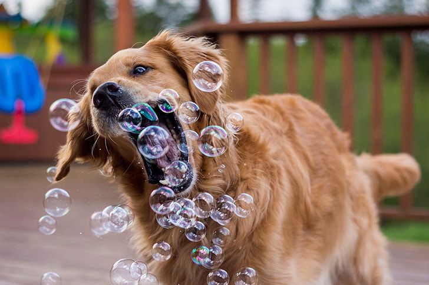
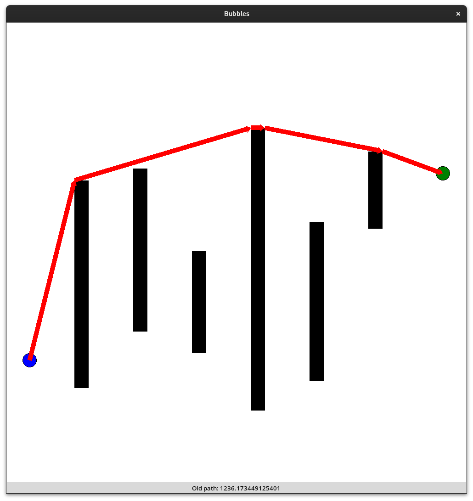
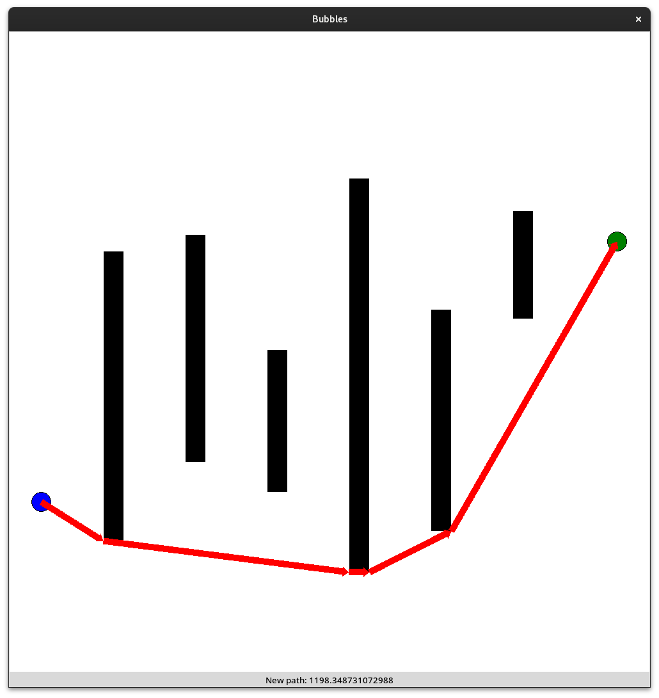
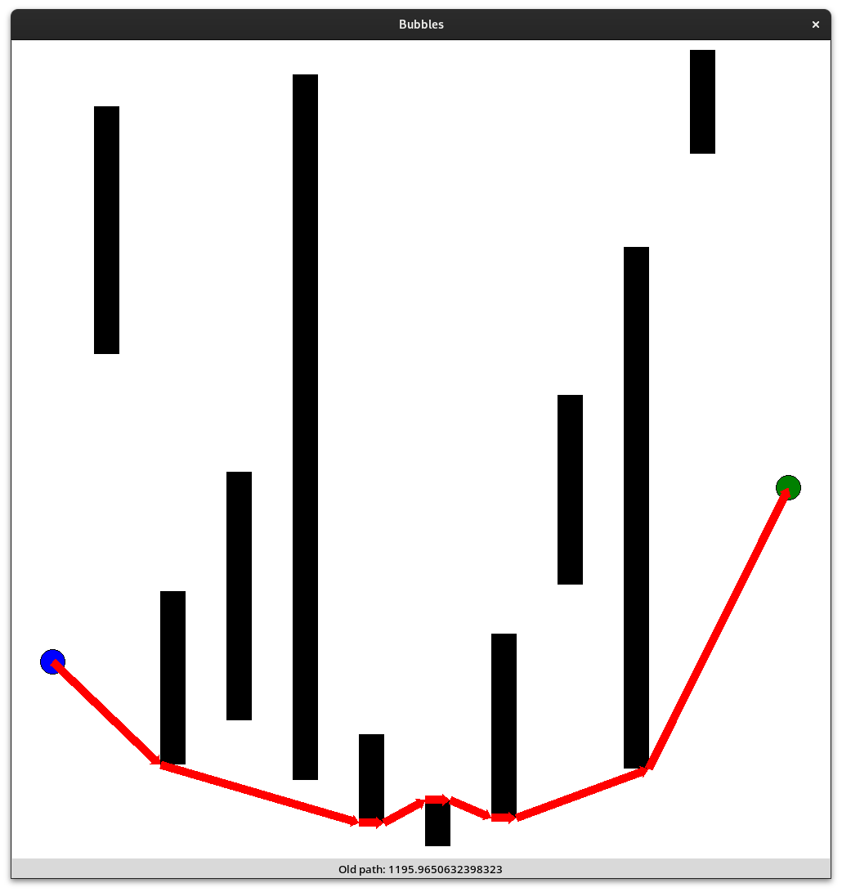
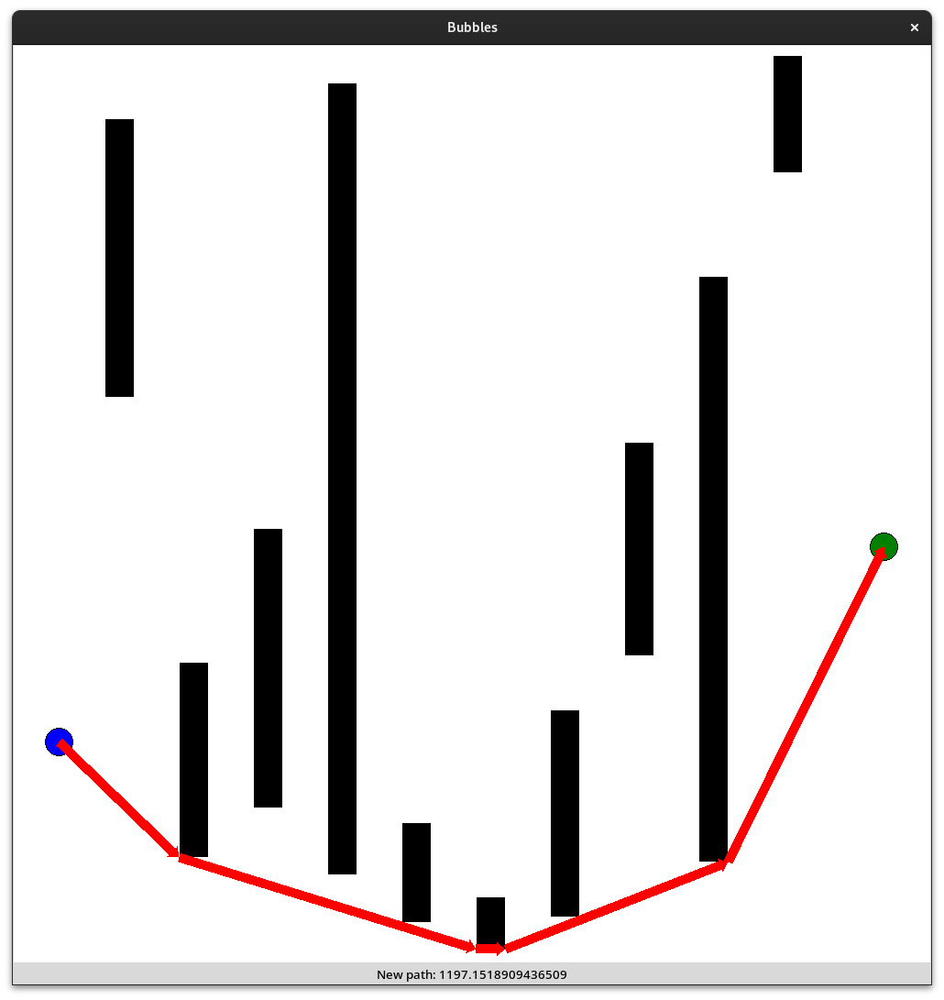

# Bubbles

Bubbles is a fun project to experiment with learning algorithms. The task is to navigate through a map with obstacles from a start to a goal.

## Map Generation
The map generation works with the following process.

1. Generate a start (left) and goal (right) 

2. Generate between 3 and 10 obstacles

3. Generate a path throgh the obstacles

### Start and Goal
The start and goal are generated randomly with a distance of 5%-10% from the border

### Obstacles
The obstacles are generated with a fixed width of 30 px. Every obstacle has a horizontal offset between 50 px and the perfect spread (every obstacle has the same distance from each other).

### Path
There are two algorithms used for path generation. The first one is an implementation of A* which is able to generate optimal paths, however it is fairly slow, especially with many obstacles. The second algorithm is a two step approximation algorithm, which is much faster, but not optimal.

#### A*
A* is a pathfinding algorithm, which is able to find the optimal path between two points in a graph network with weighted graphs. As our map is not a graph network, we need to define three things. First, we need to make a list of all the "nodes" that we use to represent our network. This can be achieved, by taking the start, goal and all the corners of the obstacles. Second, we need to define which nodes are neighboring. This is done by taking a node and checking it against all other nodes, if there is an obstacle in the way. Third, we need to define the weights of the edges. This is done by calculating the distance between the nodes.

#### Approximation Algorithm
The approximation algorithm is a two step algorithm. First, a path is generated, which is collision free, but still far from optimal. Second, the path is optimized by analyzing the structure of the path.

1. The path is generated incrementally. Starting with the direct linear path between the start and the goal. Looking at the first collision with an obstacle, the path is split in two parts. The first part is the path from the start to the optimal corner of the obstacle and the second part is the path from the optimal corner to the goal. The second part is obviously prone to continuous collisions with obstacles and therefore the same process is applied to this part. This process is repeated until the path is collision free.

2. Because of the incremental generation with disregard to future collisions, the path is not optimal. To optimize the path, every checkpoint of the path is singularly removed and the path is recalculated. If the path is collision free, even without the checkpoint, it is removed, as the path is neccessarily shorter without the checkpoint. This process is repeated until no checkpoint can be removed without collisions.

#### Comparison
Benchmarking the two algorithms on a total of 1000 randomly generated maps of size 1000 by 1000, the following results were achieved:

| Algorithm | Average Time | Average Path Length |
| --------- | ------------ | ------------------- |
| A*        | 0.2797 s     |  1060.9761 units    |
| Approx    | 0.0218 s     |  1075.0144 units    |

This makes the approximation algorithm on average 12.85 times faster than A* and only 1.3% longer.

The following image shows some maps with the path between the two algorithms differing:

<table>
    <tr>
        <th>Approximation</th>
        <th>A*</th>
    </tr>
    <tr>
        <td></td>
        <td></td>
    </tr>
    <tr>
        <td></td>
        <td></td>
    </tr>
</table>