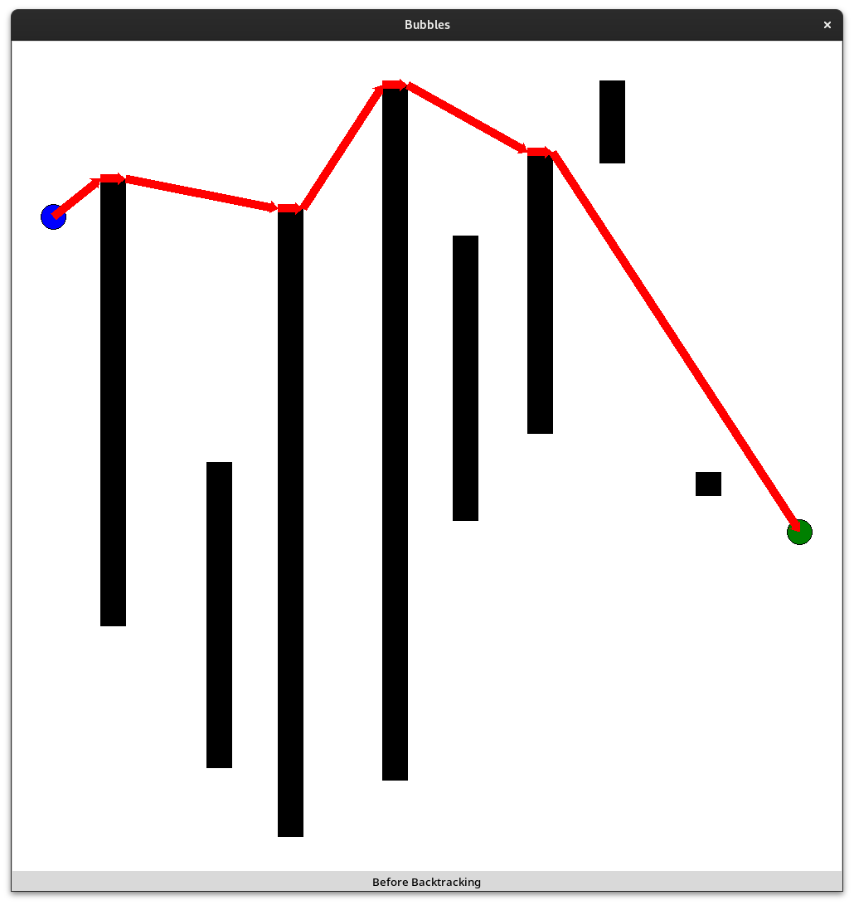

# Bubbles
Bubbles is a fun project to experiment with learning algorithms. The task is to navigate through a map with obstacles from a start to a goal.

## Map Generation
The map generation works with the following process.

1. Generate a start (left) and goal (right) 

2. Generate between 3 and 10 obstacles

3. Generate an optimal path throgh the obstacles

### Start and Goal
The start and goal are generated randomly with a distance of 5%-10% from the border

### Obstacles
The obstacles are generated with a fixed width of 30 px. Every obstacle has a horizontal offset between 50 px and the perfect spread (every obstacle has the same distance from each other).

### Optimal Path
The optimal path is generated in two steps. 

1. The path is generated incrementally. Starting with the direct linear path between the start and the goal. Looking at the first collision with an obstacle, the path is split in two parts. The first part is the path from the start to the optimal corner of the obstacle and the second part is the path from the optimal corner to the goal. The second part is obviously prone to continuous collisions with obstacles and therefore the same process is applied to this part. This process is repeated until the path is collision free.

2. Because of the incremental generation with disregard to future collisions, the path is not optimal. To optimize the path, every checkpoint of the path is singularly removed and the path is recalculated. If the path is collision free, even without the checkpoint, it is removed, as the path is neccessarily shorter without the checkpoint. This process is repeated until no checkpoint can be removed without collisions.

